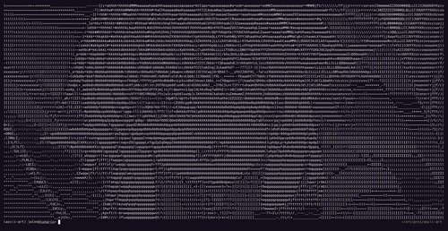

# Image to ASCII Art Converter

Converts images to ASCII art in your terminal. Images are resized to fit the
terminal window dimensions, so smaller font sizes (or zooming out) will
result in more detailed ASCII images.

## Usage
```ascii_img <ImagePath>```

## Examples

Original image:


Ascii art (no zoom):



Ascii art (zoomed out):


